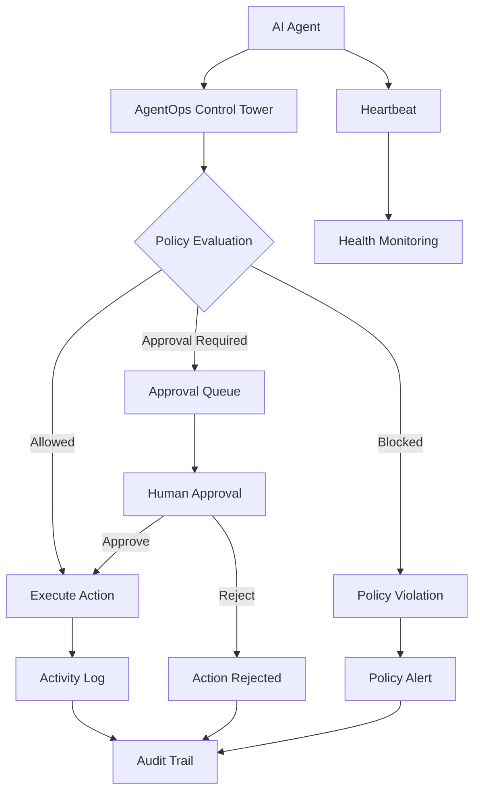

# 🛰️ AgentOps Control Tower

### Enterprise Governance and Operations Platform for AI Agents

AgentOps Control Tower provides centralized visibility, governance, policy enforcement, approval workflows, health monitoring, and audit logging for organizational AI agents.

As AI agents become part of enterprise operations, organizations need the same governance capabilities they use for human workforces: visibility, accountability, approvals, policy controls, monitoring, and rapid revocation.

AgentOps Control Tower acts as the command center for managing and governing AI agents across business functions.

---

## 📸 Platform Overview

### Command Centre

Monitor, govern and control organizational AI agents from a single platform.

### Core Capabilities

✅ Agent Inventory Management

✅ Policy Governance

✅ Approval Workflows

✅ Health Monitoring

✅ Policy Violation Management

✅ Audit Logging

✅ Activity Tracking

✅ Risk Visibility

---

## 🚀 Technology Stack

### Frontend


### Backend


### Database


### Containerization


### Governance & Operations


---

## 🏗️ Architecture

```text
+--------------------------------------------------+
|            AgentOps Control Tower                |
+--------------------------------------------------+
                        |
        +---------------+---------------+
        |                               |
   +-----------+                 +-------------+
   | AI Agents |                 | Policies    |
   +-----------+                 +-------------+
        |                               |
        +---------------+---------------+
                        |
                +---------------+
                | Approval Hub  |
                +---------------+
                        |
                +---------------+
                | Audit & Logs  |
                +---------------+
                        |
                +---------------+
                | Dashboard     |
                +---------------+
```

---

## 🎯 Key Features

### 🤖 Agent Inventory

- Register AI agents
- Agent ownership tracking
- Team assignment
- Status management
- Integration visibility

### 🛡️ Policy Governance

- Allowed actions
- Blocked actions
- Risk thresholds
- Enforcement controls
- Policy lifecycle management

### 🔐 Approval Workflows

- Human-in-the-loop approvals
- Sensitive action review
- Approval history
- Approval audit trails

### ❤️ Health Monitoring

- Agent heartbeat tracking
- Response time monitoring
- Health status visibility
- Integration monitoring

### 🚨 Policy Violation Management

- Blocked action detection
- Violation investigation workflow
- Resolution management
- Compliance tracking

### 📋 Audit Logging

- Agent registration events
- Policy updates
- Approval decisions
- Administrative activities
- Governance actions

### 📊 Risk Visibility

- High-risk agent identification
- Policy violation metrics
- Governance dashboard
- Operational status overview

---

## 🤖 Example AI Agents

The platform supports governance of AI agents across multiple business domains:

| Agent | Function |
|---------|----------|
| AI SOC Agent | Security Operations |
| Threat Intelligence Agent | Threat Intelligence |
| DevOps Agent | Platform Engineering |
| Compliance Agent | Governance & Compliance |
| Audit Review Agent | Internal Audit |
| IT Helpdesk Agent | Service Desk |
| HR Assistant | Human Resources |
| Finance Agent | Finance Operations |
| Executive Decision Agent | Executive Support |

---

## 🐳 Running with Docker

### Clone Repository

```bash
git clone https://github.com/golden-horizon/agentops-control-tower.git
cd agentops-control-tower
```

### Create Environment File

```bash
cp .env.example .env
```

Update:

```env
POSTGRES_PASSWORD=your_secure_password
```

### Start Platform

```bash
docker compose up -d --build
```

### Verify Services

```bash
docker compose ps
```

---

## 🌐 Access URLs

### Frontend

```text
http://localhost:8080
```

### Backend API

```text
http://localhost:5001
```

### Health Endpoint

```text
http://localhost:5001/health
```

---

## 📂 Project Structure

```text
agentops-control-tower/
│
├── frontend/
│   ├── src/
│   ├── Dockerfile
│   └── nginx.conf
│
├── backend/
│   ├── server.js
│   ├── Dockerfile
│   └── database logic
│
├── docker-compose.yml
├── .env.example
└── README.md
```

---

## 🛣️ Future Roadmap

### Phase 2

- Multi-agent communication visibility
- Agent lifecycle management
- Advanced policy engine
- Risk scoring automation

### Phase 3

- MCP Integration
- RBAC
- SSO Integration
- Agent marketplace
- Agent certification workflows

### Phase 4

- Multi-tenant architecture
- Enterprise reporting
- Compliance dashboards
- Governance analytics

---

## 🎓 Project Goals

This project explores how organizations can safely adopt AI agents by applying governance principles traditionally used for human workforces.

Key concepts include:

- Visibility
- Accountability
- Policy Enforcement
- Human Oversight
- Auditability
- Revocation Controls

---

# AgentOps Control Tower

...

## 🔄 Agent Governance Workflow



## 👨‍💻 Author

### Navid Ghobadpour

Cybersecurity • AI Operations • Agent Governance

GitHub:

https://github.com/golden-horizon

---

## ⭐ Support

If you found this project useful, consider giving it a star on GitHub.
